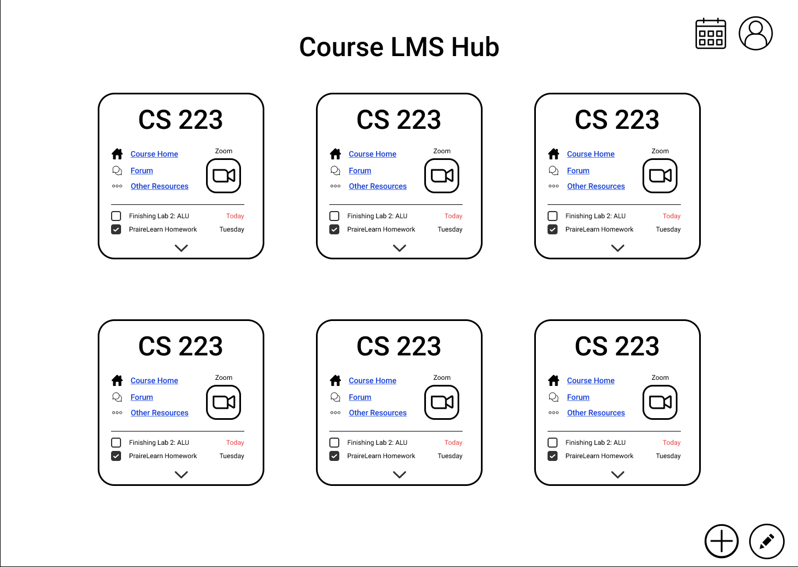

# UIUC Course Management Hub

**Overview:** UIUC CMH is a web application that helps students with organizing their courses, workload and activities throughout the semester.

**Team:** Cale Wolf, Minh Phan, Meghna Mavila, Ayushi Singh, Rithika Bhattaram.

## Background

> In order to keep track of their classes, an Illini has to manage his/her information on least 6 websites per semester. As COVID-19 strikes, the university shifted remotely. The number of sites that students have to manage eventually increases.

**&#8594; Solution:** A central hub that allows students to keep track of their course management systems in an organized manner.

## Our Approach

The Course Central Hub resembles a deck of cards that contains information about courses, activities, RSOs, etc.

**First Snapshot**

Tryout our **Figma** prototype at: https://www.figma.com/proto/ffhqRo0S7FlRcr1tKCugeu/Website-Design?node-id=0%3A1&scaling=min-zoom&page-id=0%3A1

**Where do we get the data?**

- At the **first stage** of the project, users would have to **manually input** data into the cards.
- For **future work**, we would retain data from school websites and automatically fill in the card, using website APIs. (school sites Moodle and PrarieLearn among others allow users to retrieve data from the site using API).

## Feedback

We are open to any feedback to the project!

If you have any feedback or want to contribute to the project, let us know by filling out this form: https://forms.gle/PjEL4GrqaMEV8ZPHA.

## Progress

Right now, we are still working around with the front-end design & function. We will continue to work on the back-end in the future to reach an MVP.

## Project Structure

We will be using Reactjs and Flask in this project. We have been working around front-end and back-end separately and yet to come up with an overall structure.
